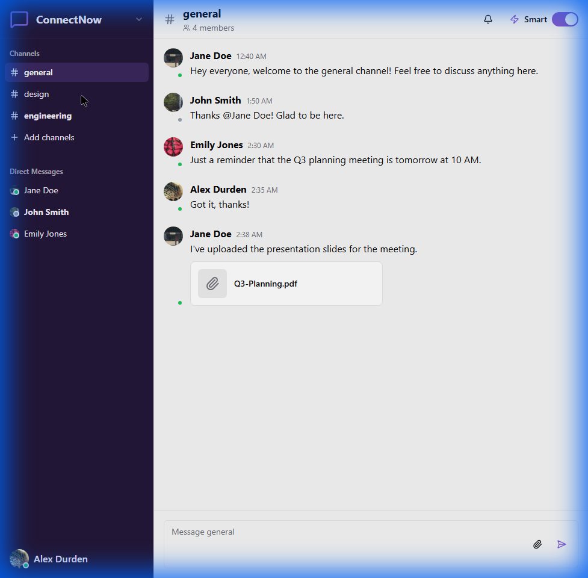
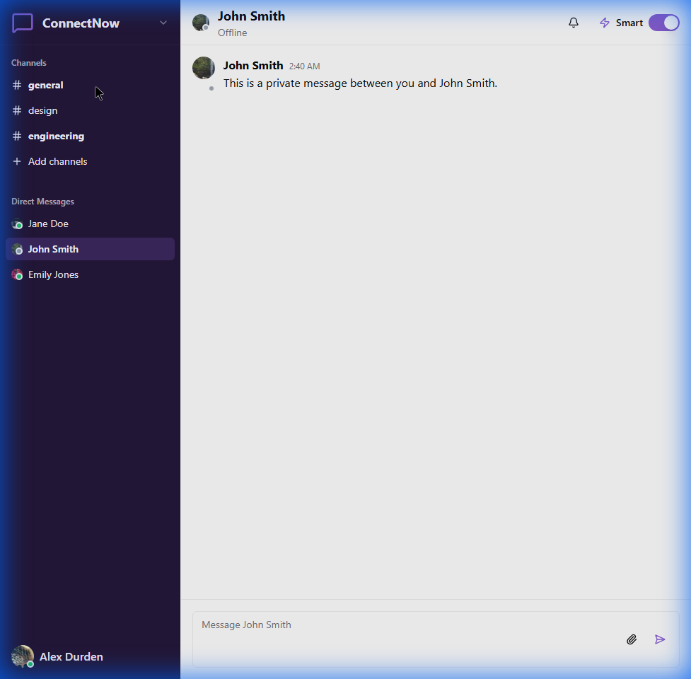
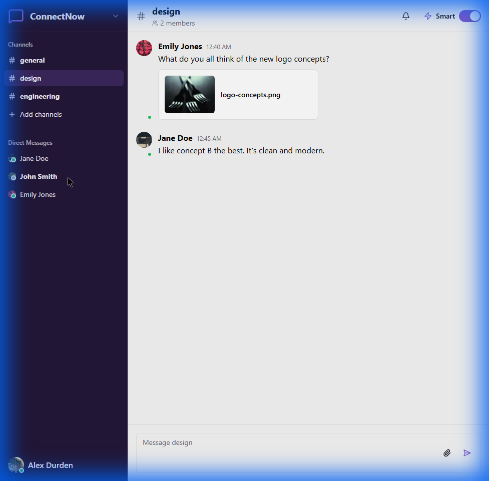
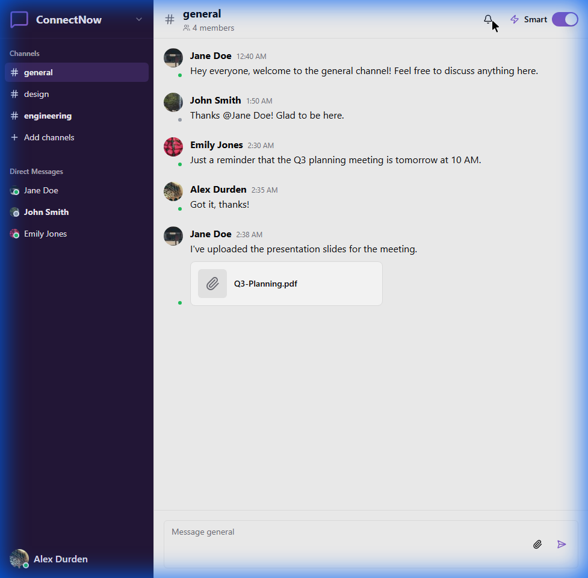

# ConnectNow


**ConnectNow** is a modern, real-time messaging platform designed for seamless team collaboration. Built with **Next.js 15**, **Socket.io**, and **Shadcn UI**, it offers a premium user experience with features like instant messaging, file sharing, and AI-powered notifications.

[**Live Demo**](https://connect-now-phi.vercel.app/)

---

## 📸 Screenshots

### Channel Collaboration
<p align="center">
  
  
</p>

### Direct Messaging & AI Features
<p align="center">
  
  
</p>

---

## ✨ Key Features

- **Real-Time Communication**: Instant messaging powered by Socket.io for both channels and direct messages.
- **Smart Notifications**: AI-driven prioritization and summarization of missed messages to keep you focused.
- **Rich Media Sharing**: Easily share images and files with dedicated previews.
- **Modern UI/UX**: A sleek, responsive interface built with Tailwind CSS and Radix UI primitives.
- **Channel Management**: Organize conversations into specific topics or teams.

## 🛠️ Tech Stack

- **Frontend**: Next.js 15 (App Router), React 18, TypeScript, Tailwind CSS, Shadcn UI / Radix UI.
- **Backend**: Node.js, Express, Socket.io.
- **AI Integration**: Google Genkit (for notification summarization and smart features).
- **Icons**: Lucide React.
- **Charts**: Recharts.

## 🚀 Getting Started

Follow these steps to run ConnectNow locally.

### Prerequisites

- Node.js (v18 or later)
- npm (v9 or later)

### Installation

1.  **Clone the repository**
    ```bash
    git clone https://github.com/yourusername/connectnow.git
    cd connectnow
    ```

2.  **Install Frontend Dependencies**
    ```bash
    npm install
    ```

3.  **Install Backend Dependencies**
    ```bash
    cd server
    npm install
    cd ..
    ```

### Running the Application

1.  **Start the Backend Server**
    Open a terminal and run:
    ```bash
    cd server
    npm run dev
    ```
    The server will start on `http://localhost:3001`.

2.  **Start the Frontend Application**
    Open a new terminal window in the root directory and run:
    ```bash
    npm run dev
    ```
    The application will be available at `http://localhost:3000`.

## 🤝 Contributing

Contributions are welcome! Please feel free to submit a Pull Request.

## 📄 License

This project is licensed under the MIT License.
